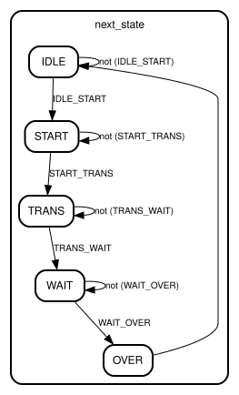

# Entity: SPI_slave 
- **File**: SPI_slave.v

## Diagram

## Ports

| Port name    | Direction | Type                   | Description |
| ------------ | --------- | ---------------------- | ----------- |
| clk          | input     | wire                   |             |
| rst_n        | input     | wire                   |             |
| data_in      | input     | wire [`DATA_WIDTH-1:0] |             |
| data_in_vld  | input     | wire                   |             |
| data_out     | output    | [`DATA_WIDTH-1:0]      |             |
| data_out_vld | output    |                        |             |
| nCS          | input     | wire                   |             |
| DCLK         | input     | wire                   |             |
| MOSI         | input     | wire                   |             |
| MISO         | output    | wire                   |             |
| CPOL         | input     | wire                   |             |
| CPHA         | input     | wire                   |             |

## Signals

| Name                                                                                              | Type                   | Description |
| ------------------------------------------------------------------------------------------------- | ---------------------- | ----------- |
| MOSI_shift                                                                                        | reg [`DATA_WIDTH-1:0]  |             |
| MISO_shift                                                                                        | reg [`DATA_WIDTH-1:0]  |             |
| state                                                                                             | reg [`STATE_WIDTH-1:0] |             |
| next_state                                                                                        | reg [`STATE_WIDTH-1:0] |             |
| DCLK_reg                                                                                          | reg                    |             |
| DCLK_edge_up                                                                                      | wire                   |             |
| DCLK_edge_down                                                                                    | wire                   |             |
| data_cnt                                                                                          | reg [`DATA_ADDR-1:0]   |             |
| IDLE_START = (state == IDLE) && (nCS == 0)                                                        | wire                   |             |
| START_TRANS = (state == START) && (CPOL?DCLK_edge_up:DCLK_edge_down)                              | wire                   |             |
| TRANS_WAIT = (state == TRANS) && (data_cnt == `DATA_WIDTH - 1)                                    | wire                   |             |
| WAIT_OVER = (state == WAIT) && ((CPHA == 'b0 && DCLK_edge_up) || (CPHA == 'b1 && DCLK_edge_down)) | wire                   |             |

## Constants

| Name  | Type | Value | Description |
| ----- | ---- | ----- | ----------- |
| IDLE  |      | 0     |             |
| START |      | 1     |             |
| TRANS |      | 2     |             |
| WAIT  |      | 3     |             |
| OVER  |      | 4     |             |

## Processes
- unnamed: ( @(posedge clk or negedge rst_n) )
  - **Type:** always
- unnamed: ( @(posedge clk or negedge rst_n) )
  - **Type:** always
- unnamed: ( @(*) )
  - **Type:** always
- unnamed: ( @(posedge  clk or negedge rst_n) )
  - **Type:** always
- unnamed: ( @(posedge clk or negedge rst_n) )
  - **Type:** always
- unnamed: ( @(posedge clk or negedge rst_n) )
  - **Type:** always
- unnamed: ( @(posedge clk or negedge rst_n) )
  - **Type:** always

## State machines

